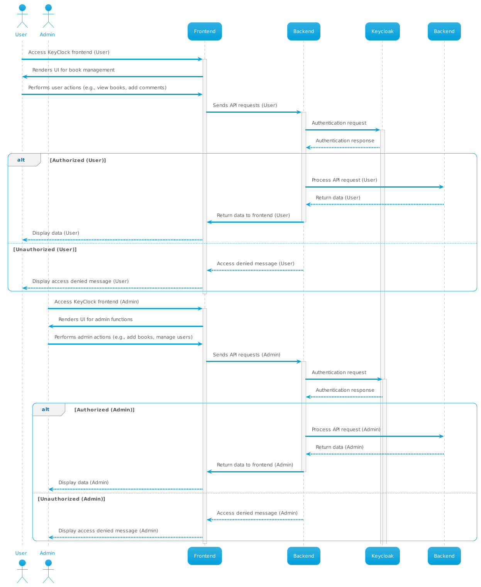
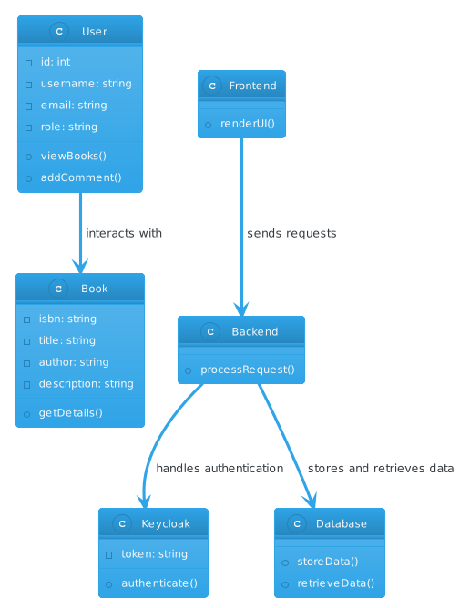
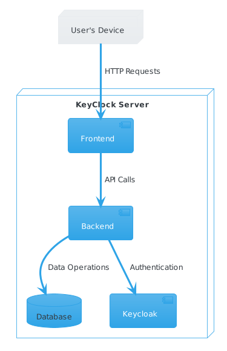
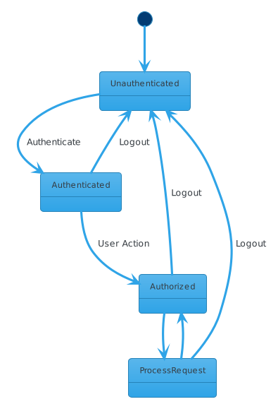

KeyClock 📚
Welcome to KeyClock - the book management system built with Spring Boot, React, and Keycloak for La Nuit de l'Info competition! 🌟

## Diagrams

Here are the diagrams illustrating the process:

-  Description of diagram 1.
-  Description of diagram 2.
-  Description of diagram 3.
-  Description of diagram 4.

## Description
KeyClock is your go-to platform for managing and exploring books using ISBNs as unique identifiers. This project utilizes Spring Boot for the backend, React for the frontend, and Keycloak for authentication and authorization.

## Endpoints 📚
Admin Services:

GET /api/bookextras/me - Retrieves admin details. Secured for roles like BOOKS_MANAGER and USER.
POST /api/bookextras/me - Uploads cover image. Secured for roles like BOOKS_MANAGER and USER.
POST /api/books - Adds a new book with details. Secured for BOOKS_MANAGER.
DELETE /api/books/{isbn} - Deletes a book. Secured for MANAGE_BOOKS.
User Services:

GET /api/books - Retrieves all books.
GET /api/books/{isbn} - Retrieves details of a specific book.
POST /api/books/{isbn}/comments - Adds comments to a book. Secured for BOOKS_MANAGER and USER.
Frontend
The frontend of KeyClock is a React-based interface designed to manage and view books. It's styled using Semantic UI React and offers a user-friendly experience.

 ## Security 📚
KeyClock implements access tokens (JWTs) to secure its endpoints. These tokens, generated similarly to the provided example, manage access based on user roles for various operations.

How to Run 📚
Backend (Spring Boot):

Navigate to the backend directory.
Run mvn spring-boot:run to start the Spring Boot server.
Frontend (React):

Go to the frontend directory.
Run npm install to install dependencies.
Run npm start to start the React frontend.
Keycloak Setup:

Set up Keycloak and configure roles (BOOKS_MANAGER, USER, MANAGE_BOOKS).
Ensure Keycloak is running and connected to the application for authentication.

## Contributors 📚
Meryem Barkallah
Rahma Mghirbi
Asma Arrak

